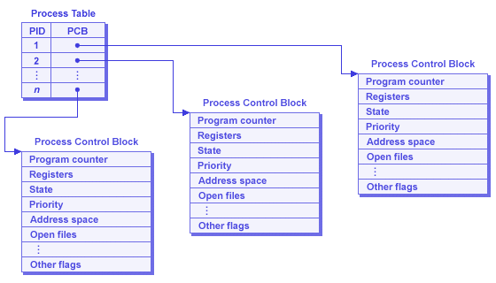

# JAVA interview based programs
## This repository contains interview based programs in java that are asked in the company exams and during the interview.
## Example code 1 ->
```
public class LearnCoding
{
  public static void main(String args[])
  {
    System.out.println("Hello World");
  }
}
```
### Explaining the example code 1
#### Here in the above program whatever written inside the main function gets executed first in it's respective order.
```
public static void main(String args[])
```
#### class : This Keyword is used to declare a ```class``` in Java
#### public : Here the ```public``` means that all the other methods or functions of ```LearnCoding``` class can access the ```main``` method.
#### void : Here ```void``` means that the ```main``` method should not return anything.
#### static : For any particular function of any particular class, if you want to use any method of any class we need to create objects. Whenever you create an object of a class it requires memory. If you declare something ```static``` you can invoke or revoke that method without using any objects. Hence it saves memory because we don't need to create any object here.
#### public static void main (psvm) : It;s the first function that is being executed in Java.
#### main : It represents the starting point of the program.
#### String[] args : It is used for command line argument. Here the name of the String array is args but it is not fixed and user can use any name in place of it.
#### System.out.println : It is used to print the content written inside the bracket inside double quotes in the terminal or a console and then move the cursor to the next line because here we have use ```println```.
## Now what happens if we change ```public static void main``` to ```public static int main```
```
public class LearnCoding
{
  public static int main(String args[])
  {
    System.out.println("Hello World");
  }
}
```
Here you will get an error - ```missing return statement``` because here you should be returning something as you have a function that should return an int value.
## What if Let's say we ```return 0```
#### Now the code looks like this ->
```
public class LearnCoding
{
  public static int main(String args[])
  {
    System.out.println("Hello World");
    return 0;
  }
}
```
#### But even after returning 0 we still get this error ```Main method must return a value of type void in class LearnCoding, please define the main method as : public static void main(String[] args)```.
#### So why is this happening?
The C and C++ programs which return int from the main function are processes of Operating System. The int value returned from the main in C and C++ is exit code or exit status. The exit code of C and C++ program illustrates, why the program terminated. Exit code 0 means successfull termination. However, non zero exit status indicates error. Example -> exit code 1 depicts Miscellaneous errors, such as "divide by zero".
Parent process of any child process keeps on waiting for the exit status of a child. And after recieving the exit status of child, cleans up the child process from the process table and frees the resources allocated to it. Which is why it becomes mandatory for C and C++ programs (which are processes of OS) to pass its exit status from main explicitly or implicitly.
#### process table of an OS looks something like this ->


# RECURSION :-
Recursion is a method where a function keeps calling itself until a base condition is met.
#### Example sudo code of recursion : Here we are calculating the factorial of n ->
```
 //recursive function that calls itself until a base condition is met here the base condition is 1 and it's calculating factorial.
 static int fact(int n)
 {
   if (n>1)
     {
       return n*fact(n-1);
     }
   else
   {
      return 1 ;
   }
 }

```
let's say ```factorial(int n)``` where ```n=5```.  
* if n>1 true then flow of function calling will be ```F[5] : 5 * F[4] --> F[4] : 4 * F[3] --> F[3] : 3 * F[2] --> F[2] : 2 * F[1] --> F[1] : 1```.  
* Now after the base condition which is 1 here is met then flow of return will be ```F[1] : 1 --> F[2] : 2 * 1 = 2 --> F[3] : 3 * 2 = 6 --> F[4] : 4 * 6 = 24 --> F[5] : 5 * 24 = 120```.  
* If the base condition is met then the function calling stops and immidiately the immidiate values are followed up.


## Power using recursion ->
```
// calculate the power of a number if the power is positive
static long p(long x, long n)
{
  if (n!=0)
  {
    return x*p(x,n-1);
  }
  else
  {
    return 1;
  }
}
```
#### Calculate the power of number if the power is positive using recursion.

## Fibnocci series ->
```
static int fib(int n)
{
if (n==0)
{
  return 0;
}
if(n==1 || n==2)
{
  return 1;
}
return fib(n-1)+fib(n-2);
}
```
Any position in a fibnocci series is nothing but the sum of the last two digits ``` F(n) = F(n-1) + F(n-2) ```.  
The first two digits will always be 0 and 1 ``` F(0) = 0 & F(1) = 1 ```  
A tree will form because of parallel recursion when calculating fibnocci numbers through recursion technique.

## First and Last occurance in array ->
Let's say there is an array ``` A[3,5,7,2,4,5] ``` here we need to search for 5 in  
this array and print the first index of it i.e search for first occurance of 5 in  
the array. But before we do that let's clear out some basics.
#### enter the array elements recursively
```
//Enter elements in the array recursively
static void enterArray(int arr[],int i)
{
    if(i==arr.length)
    {
      return;
    }
    Scanner sc2 = new Scanner(System.in);
    arr[i] = sc2.nextInt();
    //i++ will not be accepted here it will cause the code to explode use i+1 instead
    enterArray(arr,i+1);
}
```
#### print the array elements recursively
```
//Print elements in the array recursively
static void printArray(int arr[],int i)
{
    if(i==arr.length)
    {
      return;
    }
    System.out.println(arr[i]);
    //i++ will not be accepted here it will cause the code to explode use i+1 instead
    printArray(arr,i+1);
 }
```
#### Tree representing the flow of function calling and dataflow

#### Printing array in reverse order
```
//Print elements in the array recursively in reverse order
static void printArrayReverse(int arr[],int i)
{
    if(i==-1)
    {
      return;
    }
    System.out.print(arr[i] + " ");
    //i++ will not be accepted here it will cause the code to explode use i+1 instead
    printArrayReverse(arr,i-1);
 }
```
#### First occurance -> It means the first appearance of an element in the array.
```
//printing the first occurance of the element in the array
static void first_occurance_element(int arr[],int i,int num)
{

  if(i==arr.length)
  {
    return;
  }
  if (arr[i]==num)
  {
    System.out.println(arr[i] + " first occured in index "+i);
    return;
  }
  //i++ will not be accepted here it will cause the code to explode use i+1 instead
  first_occurance_element(arr,i+1,num);
}
```
#### Last occurance -> It means the last appearance of an element in the array.
```
//printing the last occurance of the element in the array
static void last_occurance_element(int arr[],int i,int num)
{
    if(i==-1)
    {
      return;
    }
    if (arr[i]==num)
    {
      System.out.println(arr[i] + " last occurance is in index "+i);
      return;
    }
    //i++ will not be accepted here it will cause the code to explode use i+1 instead
    last_occurance_element(arr,i-1,num);
 }
```
## Largest and smallest number in the array through recursion
```
//finding the largest number in the array
static void largest(int arr[],int i,int largest)
{
  if (i==arr.length)
  {
    System.out.println("Largest element in the array is = "+largest);
    return;
  }
  if (arr[i]>largest)
  {
    largest = arr[i];
  }
  largest(arr,i+1,largest);
}
```
```
//finding the smallest element in the array
static void smallest(int arr[],int i,long smallest)
{
  if (i==arr.length)
  {
    System.out.println("Smallest element in the array is = "+smallest);
    return;
  }
  if(arr[i]<smallest)
  {
    smallest = arr[i];
  }
  smallest(arr,i+1,smallest);
}
```
## Practice questions
### Problem 1 - Figure out the pattern and solve it using a recursive function to achieve the above for any positive number n
sample input 1----1  
sample output 1-----111  
sample input 2----2  
sample output 2----211121112  
sample input 2----3  
sample output 3----321112111232111211123
```
//This recursive function will print the pattern
public static void printpattern(int n){
    if(n == 0){
        return;
    }
    System.out.print(n + " ");
    printpattern(n-1);
    System.out.print(n + " ");
    printpattern(n-1);
    System.out.print(n + " ");
}
```
# Data Structure Time and Space complexities
## Points to remember :
## The three Asymptotic notations : 
#### Big Theta notation
* It expresses both the upper bound and lower bound of an algorithm's running time.
* By lower bound and Upper bound means for any given input this notation determines average amount of time an algorithm can take to complete.
#### Omega Notation
* It is the formal way to express the lower bound of an algorithm's running time.
* Lower bound means for any given input this notation determines best amount of running time an algorithm can take to complete.
* This helps us determine what is the minimum amount of resources we need to run a particular algorithm.
#### Big O notation
* This is the formal way to express the upper bound of an algorithm's running time.
* Upper bound means for any given input this notation determine's longest amount of time an algorithm can take to complete.
* Big O notation provides us with the worst case analysis of an algorithm.
#### Rules of Big(O) Notation
* Assume the machine on which your algorithm is running is a single processor machine.
* Assume that the processor executes the instruction sequentially.
* Assume the assignment operation takes 1 unit of time. ```x = 5 --> 1 unit of time;```
* Assume the return statement takes 1 unit of time . ```return 5 --> 1 unit of time;```
* Assume the arithematic operation takes 1 unit of time. ```sum = a + b --> 1 unit of time;```
* Logical operation takes 1 unit of time.
* Other smal/single operations takes 1 unit of time.
* Drop lower order terms and constants--> ``` T = n^2+3n+1 --> O(n^2) ```
* Drop constant multipliers
#### Calculate the Time complexitiy of Constant algorithm
#### Question 1 :
```
public int sum(int x , int y){
int result = x+y;
return result;
}
```
| Line no. | Operations    | Unit Time     |
| -------- | ------------- | ------------- |
| 2.       | 1+1+1+1       | 4             |
| 3.       | 1+1           | 2             | <br />
<br />
Total time taken (T)=> 4+2 = 6 <br />
T~C(Constant amout of time) <br />

#### Question 2
```
public int get(int[]arr, int i){
  return arr[i];
  }
```
Time complexicity of the algorithm which have constant time as O(1) <br />
The graph below shows the constant time of O(1) <br />


#### Calculate the Time complexitiy of Linear algorithm
#### Question 1:
```
public void findsum(int n){
    int sum= 0; // 1 step
    for(int i=1;i<=n;i++) //this for loop will get executed n+1 times
    {
      sum=sum+i; //n steps
    }
    return sum ; //1 step
}
```
<br />

The for loop ``` for(int i=1;i<=n;i++) ``` will get executed n+1 times and each time the for loop executes it will perform three operations. <br />
So the total number of operations in line 3 for this for loop will be ``` 1+3(n+1) ``` <br />
Now we focus on ``` i++ ``` part of the for loop. For int n ``` i++ ``` will execute n number of times and each time it executes it performs 3 operations. <br/>
So our operations for the for loop becomes ``` 1+3(n+1)+3n ```. On solving the equation becomes <br /> ``` 1+3n+3+3n --> 4+6n ~ is the total unit of time it will take```

<br />

| Line no. | Operations    | Unit Time     |
| -------- | ------------- | ------------- |
| 2.       | 1             | 1             |
| 3.       | 1+3(n+1)+3n   | 4+6n          |
| 4.       | n(1+1+1+1)    | 4n            |
| 6.       | 1+1           | 2             |

<br />

Total time (T) = 1+4+6n+4n+2 --> 7+10n --> O(n) is the time complexity of the given algorithm. <br />
The graph below shows how the linear algorithm is plotted on the graph : <br />


#### Calculate the Time complexitiy of Polynomial algorithm
#### Question 1
```
public void print(int n){
    for(int i =1; i<=num;i++)
    {
       for(int j=1;j<=n;j++){
           System.out.println("i= "+i+ " j= " +j);
       }
       System.out.println("End of inner for loop");
    }
    System.out.println("Outer for loop end");
}
```
<br />

| Line no. | Operations     | Unit Time          |
| -------- | -------------- | ------------------ |
| 2.       | 1+3(n+1)+3n    | 4+6n               |
| 3.       | (1+3(n+1)+3n)n | (4+6n)n -> 4n+6n^2 |
| 4.       | n^2(1+1+1)     | 3n^2               |
| 6.       | n(1)           | n                  |
| 8.       | 1              | 1                  |

<br />

The total time complexity (T) = 4+6n+4n+6n^2+3n^2+n+1 <br />
5+11n+9n^2 --> O(n^2) <br />

The graph when we plot the polynomial algorithm : <br />


#### Big O notation order
* O(1) - Constant time
* O(log n) - Logarithmic time
* O(n) - Linear time
* O(n log n) - quasilinear time
* O(n²) - quadratic time


# Arrays :-
### What is an Array?
* An array is a collection of adjacent and contigious elements of the same type.
* The size of an array is fixed and cannot be modified.
* Being adjacent each partition is indexed and can be determined by its position.
* index starts at 0 and ends at length-1.

### Declaring an array
* One dimensional array can be declared ``` dataType arrayName[]; ``` OR ``` dataType[] arrayName; ```
### Initializing an array
* It gives memory to array elements. One dimensional array can be initialized via syntax :-> ``` arrayName = new dataType[size]; ```
* The size can be entered in run time via scanner class : <br />
```
Scanner sc = new Scanner(System.in);
int size = sc.nextInt();
int array[] = new int[size];
```

## Linear search
Points to remember  
* Time complexity O(n) Because there is only 1 for loop.
* Best case senario time complexity O(1) When the element to be searched is in First position.
* Worst case time complexity O(n) When the element to be searched is at the Last position.
* Space complexity O(1) because the size of the array is not growing it is constant.
* Average comparisions (n+1)/2
### Linear search algorithm outline

### Linear search through recursion
```
//This function will perform linear search on the array
static void Linear_Search(int arr[], int i,int num)
{
  if(i==arr.length-1)
  {
    return;
  }
  if(arr[i]==num)
  {
    System.out.println("The number "+num+ " is in index "+i);
  }
  Linear_Search(arr,i+1,num);
}
```
### Linear search through for loop
```
for(int i =0;i<arr.length;i++)
{
  if(arr[i]==num)
  {
    System.out.println(arr[i] + " is in index " + i);
  }
}
```
## Binary Search


Points to remember
* Time complexity O(log n)
* Best case senario time complexity O(1) When the element to be searched is in First position.
* Worst case time complexity O(log n) When the element to be searched is at the Last position.
* Space complexity O(1) because the size of the array is not growing it is constant.
#### Important NOTE : Binary search is only useful when the array is sorted either in ascending order or in descending order.
### Binary search through recursion
```
//This function will perform binary search on the array
/*
This recusrion method of binary search will only work if the array is in
the ascending order. I will not work if the array is in descending order.
*/
static int Binary_Search(int arr[],int left,int right,int num)
{
  int mid ;
  if(right>=left)
  {
    mid = left + (right - left)/2;
    if(arr[mid]==num)
    {
      return mid;
    }
    else if(num<arr[mid])
    {
      return Binary_Search(arr,left,mid-1,num);
    }
    else //if num>arr[mid]
    {
      return Binary_Search(arr,mid+1,right,num);
    }
  }
  else //if the number is not found in the array
  {
    return -1;
  }
}
```
### Binary search using for loop
```
//binary search through while loop
public static void binarySearchWhileLoop(int arr[],int left, int right, int num)
{
  int mid = (left+right)/2;
  while(left<=right)
  {
    if(arr[mid]<num)
    {
      left = mid+1;
    }
    else if(arr[mid]>num)
    {
      right = mid-1;
    }
    else
    {
      System.out.println(arr[mid]+" is in index "+mid);
      break;
    }
    mid = (left+right)/2;
  }
  if(left>right)
  {
    System.out.println("Element not found");
  }
}
```
## Bubble sort
The reason why this algo is called bubble sort because it takes inspiration from a bubble formed in a cold drink.  
The largest bubble formed at the bottom of the glass rises to the top towards the surface more quickly than the smaller ones.  
Bubble Sort is the elementary sorting algorithm for sorting various data structures. It is a comparison-based sorting algorithm in which each element is compared with the next element, and is swapped if those elements are not in the correct order.
* The algorithm starts with comparing the first pair of elements.
* If the first element is smaller than the second element, then the elements are swapped
* This algorithm is not suitable for large data sets.  
### bubble sort algorithm outline
#### NOTE : This complexities is only true when the bubble sort is optimized. If the Bubble sort algorithm is not optimized then the worst and best case senario time complexity will always be O(n^2).

  
Algorithm for Bubble Sort in Java
* Step1: Repeat step 1 to 4 for i=0 to n
* Step2: For j=0 to n
* Step3: if(arr[j]>arr[j+1]
* Step4: swap(arr[j],arr[j+1])
* Step5: End  
Bubble sort algotrithm visualization with example :  
  
#### NOTE: Bubble sort is a swapping algorithm because at any point in time swapping between the elements happens.  
#### Pros and Cons of bubble sort
#### Pros:  
* Easy to implement
* Cool to implement
* Gives largest value of the array in the first pass itself.
* Gives the smallest value of the array in the first pass itself (with minor tweaks in the implementation).
* No demand for large amount of memory for operation.
#### Cons :
* Noob (Bad) algorithm
* very horrible time complexity O(n^2)
### Bubble sort using loops
```
//bubble sort using loop
public static void bubbleSortUsingLoop(int arr[])
{
  /*
  The reason why we are using arr.length-1 in the loop for passes because j+1
  will go out of bounds if we would have run the loop for arr.length
  */
  for(int i =0;i<arr.length-1;i++) //loop for number of passes
  {
    /*
     pass 1 : i=0 len=5
              j< len - 0 -1 ; 5-0-1=4
              j will run from 0 to 4 (number of iterations in each pass)
     pass 2 : i=1 len=5
              j< len - 1 -1 ; 5-1-1=3
              j will run from 0 to 3 (number of iterations in each pass)
     pass 2 : i=2 len=5
              j< len - 2 -1 ; 5-2-1=2
              j will run from 0 to 2 (number of iterations in each pass)
     pass 2 : i=3 len=5
              j< len - 3 -1 ; 5-3-1=1
              j will run from 0 to 1 (number of iterations in each pass)
    */
    for(int j = 0;j<arr.length-i-1;j++) //loop for number of iterations
    {
      if(arr[j]>arr[j+1])
      {
        int temp = arr[j];
        arr[j]=arr[j+1];
        arr[j+1]=temp;
      }
    }
  }
}
```  
This program have O(n^2) in worst, average and best case senario. This is because the loop for the passes will run from 0 to N irrespective wheather the array is entirely or partially sorted.   
Now making some tweaks to the above program so that it gives us the O(n) in best case senario.
```
//bubble sort using loop optimized version
public static void bubbleSortUsingLoopOptimized(int arr[])
{
  /*
  The reason why we are using arr.length-1 in the loop for passes because j+1
  will go out of bounds if we would have run the loop for arr.length
  */
  for(int i =0;i<arr.length-1;i++) //loop for number of passes
  {
    // for optimization when array is already sorted and no swapping happens
    boolean swapped = false;
    /*
     pass 1 : i=0 len=5
              j< len - 0 -1 ; 5-0-1=4
              j will run from 0 to 4 (number of iterations in each pass)
     pass 2 : i=1 len=5
              j< len - 1 -1 ; 5-1-1=3
              j will run from 0 to 3 (number of iterations in each pass)
     pass 2 : i=2 len=5
              j< len - 2 -1 ; 5-2-1=2
              j will run from 0 to 2 (number of iterations in each pass)
     pass 2 : i=3 len=5
              j< len - 3 -1 ; 5-3-1=1
              j will run from 0 to 1 (number of iterations in each pass)
    */
    for(int j = 0;j<arr.length-i-1;j++) //loop for number of iterations
    {
      if(arr[j]>arr[j+1])
      {
        int temp = arr[j];
        arr[j]=arr[j+1];
        arr[j+1]=temp;
        swapped = true;
      }
    }
    /*
    This will stop the passes loop from progressing anyfurther if there is no
    swapping happening in any iteration of a particular pass which would mean
    that the array elements are already sorted.
    */

    if(swapped==false)
    {
      break;
    }
  }
}
```  
Here we will stop the passes loop from progressing anyfurther if there is no
swapping happening in any iteration of a particular pass which would mean
that the array elements are already sorted.
### Bubble sort using recursion
```
//bubble sort using recursion
  public static void bubbleSortUsingRecursion(int arr[],int n)
  {
         // Base case
    if (n == 1)
        return;

     int count = 0;
    // One pass of bubble sort. After
    // this pass, the largest element
    // is moved (or bubbled) to end.
    for (int i=0; i<n-1; i++)
        if (arr[i] > arr[i+1])
        {
            // swap arr[i], arr[i+1]
            int temp = arr[i];
            arr[i] = arr[i+1];
            arr[i+1] = temp;
              count = count+1;
        }

      // Check if any recursion happens or not
      // If any recursion is not happen then return
     if (count == 0)
        return;

     // Largest element is fixed,
     // recur for remaining array
     bubbleSortUsingRecursion(arr, n-1);
  }
```
## Insertion sort
Working of Insertion Sort
* Consider that there are 5 elements in an array which are to be sorted.
* First, we consider the 0th index as sorted part and the rest is unsorted.
* Then we compare the next element of the array with the first element of the array, if the first element is smaller then the second element then we swap the elements, otherwise we place the element after the first element
* Thus each time we insert element the sorted array becomes larger and unsorted becomes smaller, and the new element is to be compare with all the previous elements of the sorted array and adjust the element just next to its smaller element.
* We repeat this process till all the elements in array become part of the sorted array.  

Insertion sort algotrithm visualization with example :  
  

### Insertion sort using Loops
```
//insertion sort using loop
static void insertionSortUsingLoop(int arr[])
{
    //insertion sort outer loop to drive the insertion sort
    for(int i=1;i<arr.length;i++)
    {
      int temp = arr[i]; //backup the lement to be sorted
      int j = i-1; //initialize the j variable to i-1
      //insertion sort inner loop to drive the shifting of elements in the array
      while(j>=0 && arr[j]>temp)
      {
        /*
         Shifting the elements until jbecomes 0 or we find an element which is
         less than the number (temp) which is being sorted here
_          */
        arr[j+1]=arr[j]; //shifting elements
        j=j-1; //update j to keep driving the while loop
      }
      arr[j+1] = temp; //put the temp variable in a sorted fashion in the array
    }
}
```
### Insertion sort using recursion
```
// insertion sort using recursion
static void insertionSortRecursive(int arr[], int n)
{
    // Base case
    if (n <= 1)
        return;

    // Sort first n-1 elements
    insertionSortRecursive( arr, n-1 );

    // Insert last element at its correct position
    // in sorted array.
    int temp = arr[n-1];
    int j = n-2;

    /* Move elements of arr[0..i-1], that are
      greater than key, to one position ahead
      of their current position */
    while (j >= 0 && arr[j] > temp)
    {
        arr[j+1] = arr[j];
        j--;
    }
    arr[j+1] = temp;
}
```
### Points to remember about insertion sort

### Plus Points :
* Easy to understand.
* works efficiently on smaller datasets.
* Uses no additional memory for sorting O(1) space complexity.
* If data sets are already sorted or nearly sorted it has O(n) space complexity.
### Negative points :
* very bad time complexity of O(n^2)
* Shifting items in the array in insertion sort method is costly.
## Quick Sort
#### How the algorithm works?
* Choose the pivot element.
* Move the elements smaller to pivot in the left partition.
* Move the elements greater than pivot to the right partition.
* The partition index is discovered at the end.  
#### Now pivot is then chosen in each of the partition and the above steps are repeated until partition of one item each is reached.
Generally, pivot can be chosen as ny of the following -->  
1. Last element
2. First element
3. Random element
4. Median element  
#### Here we will choose the last element as a pivot
### Implementation of quick sort


#### Code for the quick sort
```
//This function applies quick sort using recursion
static void quick_sortUsingRecursion(int arr[], int low, int high) //handleing recursion
{
  if(low<high)
  {
    int indexPI = partition(arr,low,high);
    quick_sortUsingRecursion(arr,low,indexPI-1); //left partition
    quick_sortUsingRecursion(arr,indexPI+1,high); //right partition
  }
}
static int partition(int arr[], int low,int high) //handleing quick sort logic
{
  int swapIndex = low-1;
  int pivot = arr[high];
  for(int j = low;j<high;j++)
  {
    if(arr[j]<pivot)
    {
      swapIndex++;
      int temp=arr[j];
      arr[j]=arr[swapIndex];
      arr[swapIndex]=temp;
    }
  }
  int temp2 = arr[swapIndex+1];
  arr[swapIndex+1]= arr[high];
  arr[high]= temp2;
  return swapIndex+1;
}
```
### Points to remember in quick sort
  
Space Complexity is O(1) since we didn't need any extra array, since its in-place algorithm that is are all sorted within the original array itself.  
The Auxiliary space complexity is O(log n) due to function call stack.
#### Advantages of quick sort
* This sorting algo is quick.
* Reliable algorithm and used a lot in the industry.
#### Disadvantages of quick sort
* Very difficult to understand
* If the first element is chosen as a pivot by some idiot then it causes worst-case complexity of O(n^2).
## Selection Sort
### Points to remember in Selection sort
* Time Complexity : O(N^2)
* Space Complexity : O(1)
* Best Case, Worst Case, Avg Case : O(n^2)

#### Sample program of selection sort
```
//selection sort
static void selectionSort(int arr[])
{
    for(int i=0;i<arr.length-1;i++)
    {
      int min_index = i;
      for(int j = i+1; j<arr.length; j++)
      {
        if(arr[j]<arr[min_index])
        {
          min_index = j;
        }
      }
      //swapping here
      int temp = arr[min_index];
      arr[min_index]=arr[i];
      arr[i]=temp;
    }
}
```
## Frequency of a number in an array (Optimized version)
### Points to remember
* This algorithm calculates the frequency of a number in an array
* Time complexity : O(n log n) + O(n) = O(n logn)
* Space complexity : O(1)
* Here the array must be sorted in ascending order
```
static void CountFrequency(int arr[], int n)
{
     int i = 0;
     while (i<n)
     {
       int  count = 1;

     while (i<n-1 && arr[i]==arr[i+1])
     {
       i++;
       count++;
     }
     System.out.println(arr[i] + " is present "+count+ " times in the array ");
     i++;
   }
}
```
## Problem Statements
### Given a string s, reverse only all the vowels in the string and return it. The vowels are 'a', 'e', 'i', 'o', and 'u', and they can appear in both lower and upper cases, more than once.
Example 1:  
Input: s = "hello"  
Output: "holle"  
Example 2:  
Input: s = "leetcode"  
Output: "leotcede"  
Constraints:  
1 <= s.length <= 3 * 105  
s consist of printable ASCII characters.
```
import java.util.*;
public class reverseVowels {
public static void main(String[] args) {
        Scanner sc = new Scanner(System.in);
        String s = sc.nextLine();
        char[] c = s.toCharArray();
        int i = 0;
        int j = c.length - 1;
        while (i < j) {
            if (isVowel(c[i]) && isVowel(c[j])) {
                char temp = c[i];
                c[i] = c[j];
                c[j] = temp;
                i++;
                j--;
            } else if (isVowel(c[i])) {
                j--;
            } else if (isVowel(c[j])) {
                i++;
            } else {
                i++;
                j--;
            }
        }
        System.out.println(String.valueOf(c));
    }
    public static boolean isVowel(char c) {
        return c == 'a' || c == 'e' || c == 'i' || c == 'o' || c == 'u';
    }
}
```
